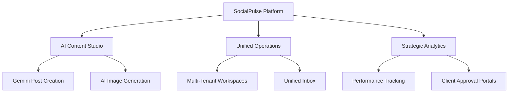
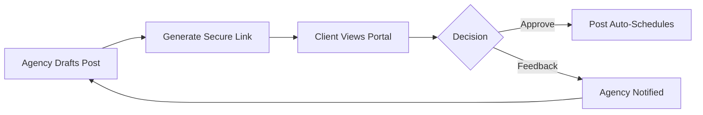
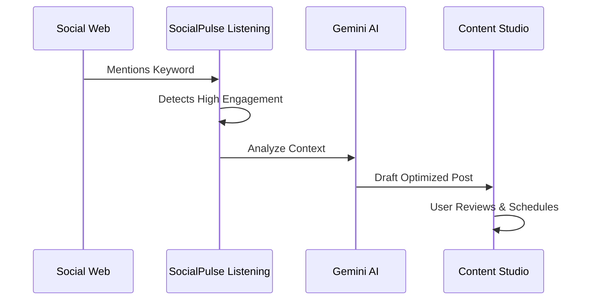

# SocialPulse: The Complete Instruction Manual

> This is the consolidated version of the SocialPulse documentation suite.

---

# 01. Introduction & Overview

Welcome to **SocialPulse**, the premier all-in-one, AI-powered social media management SaaS platform designed for modern agencies, entrepreneurs, and marketing teams.

## Mission
Our mission is to democratize high-conversion social media marketing by putting the power of advanced AI (Gemini) and enterprise-grade scheduling tools into the hands of every creator. SocialPulse isn't just a scheduling tool; it's a **Revenue Engine** that helps you transform engagement into growth.

## Platform Pillars


## Why SocialPulse?
In a world where social algorithms change daily, SocialPulse provides the stability and intelligence needed to stay ahead. Whether you're managing a single personal brand or a portfolio of 50 clients, our platform scales with you, providing the same premium experience at every level.

---

# 02. Getting Started

Setting up your SocialPulse account is the first step toward social media mastery. This guide covers registration, profile configuration, and your initial platform orientation.

## 1. Creating Your Account
1. **Navigate to SocialPulse**: Visit our main application portal.
2. **Registration Options**:
   - **Direct Email**: Sign up with your professional email and a secure password.
   - **Google OAuth**: Fast-track your registration by connecting your Google account.
3. **Plan Assignment**: Upon registration, you are automatically assigned to our **Free Tier**. This allows you to explore the platform immediately with a complimentary balance of AI credits.

## 2. Completing Your Profile
Your profile settings ensure that SocialPulse works for your specific needs.
* **Full Name & Avatar**: Personalize your account to make team collaboration easier.
* **Password Management**: Change your password at any time via the security tab.
* **Notification Preferences**: Configure how and when you receive alerts for:
  - Successful/Failed publishing.
  - Team invitations.
  - Weekly analytics digests.

## 3. The Dashboard Layout
When you first log in, you'll be greeted by your central dashboard:
* **Top Navbar**: Contains your Workspace Switcher, Notification Bell, and Quick-Action "Create Post" button.
* **Left Sidebar**: Your primary navigation for Content Studio, Assets, Monitoring, and Account Management.
* **Main Feed**: A real-time view of your AI Credit balance, high-level metrics, and upcoming scheduled content.

## 4. Understanding AI Credits
Most AI-powered actions (writing, reviewing, image generation) consume **AI Credits**.
* **Monthly Refresh**: Your credits refresh at the start of your billing cycle.
* **Usage Bar**: Monitor your consumption in the sidebar to ensure you never run out during a big campaign launch.

---

# 03. Workspace Setup & Branding

SocialPulse is built on a powerful multi-tenant architecture. **Workspaces** allow you to isolate data for different brands, departments, or clients while using a single login.

## 1. What is a Workspace?
A workspace is a completely isolated environment containing its own:
* Social Media Accounts
* Media Library
* Hashtag Sets
* Campaigns & Content
* RSS Feeds
* E-commerce Stores & Products
* Analytics Data

## 2. Creating & Managing Workspaces
* **Creating**: Click the Workspace Selector in the top navbar and select "Manage Workspaces" to add a new brand.
* **Switching**: Use the dropdown to jump between brands instantly. The entire UI will refresh to show data only for that specific brand.

## 3. High-Fidelity Branding Settings
Every workspace can be uniquely branded to reflect the corporate identity of the client or brand you are managing.
* **Brand Identity**: Upload a logo and set a display name.
* **UI Customization**: Set a "Brand Color" to personalize the interface (injected as a CSS variable across the UI).
* **Custom Domain**: Set a custom domain for the workspace's public-facing approval portal and brand pages.
* **AI Guidelines**: Provide the AI with specific instructions for this brand (e.g., "Always use emojis," "Tone: Professional but witty," "Never mention competitors"). The Gemini AI follows these rules for every post, reply, and plan it drafts in this workspace.
* **Purchase URL (Default CTA Link)**: Set a store or landing page URL. The platform automatically shortens it via the built-in link shortener and injects the short link into all AI-generated content. The AI Reviewer will also flag if your post is missing this link.

## 4. Built-in Link Shortener
When a `Purchase URL` is set on a workspace, SocialPulse automatically:
1. Generates a unique 8-character short code (e.g., `https://usesocialpulse.com/l/aB3xY7kQ`).
2. Reuses the same short code for the same URL (no duplicates).
3. Tracks click counts on every short link.
4. Injects the short link into every AI-generated post, magic plan, reply, and product post for that workspace.

## 5. Team Collaboration
* **Inviting Members**: Send email invitations to colleagues or clients.
* **Role-Based Access Control (RBAC)**:
  - **Owner**: Full access including billing.
  - **Admin**: Can manage settings, members, and all content.
  - **Member**: Can create and schedule content.
  - **Viewer**: Read-only access to analytics and scheduled posts (perfect for client review).

---

# 04. Social Accounts Integration

Connecting your platforms is the core of the SocialPulse experience. Our high-fidelity interface makes managing multiple platforms feel native and professional.

## 1. Supported Platforms
SocialPulse currently supports:
* **X (Twitter)**: Full posting and engagement tracking.
* **Instagram**: Business and Creator accounts (via Facebook).
* **Facebook**: Pages and Groups management.
* **LinkedIn**: Personal profiles and Company pages.
* **Canva**: Direct integration for design workflows.

## 2. Connection Process
1. **Navigate to Settings**: Go to the "Connected Accounts" tab within your workspace.
2. **Authorize**: Click "Connect" on your chosen platform. You will be taken to the platform's official authorization page.
3. **Permissions**: Grant all requested permissions. These are essential for SocialPulse to publish content and fetch analytics on your behalf.
4. **Return to Pulse**: Once authorized, you will be redirected back to a branded confirmation page in SocialPulse.

## 3. High-Fidelity UI
When accounts are connected, you will notice the SocialPulse interface adopts the **official brand colors and gradients** of those platforms.
* **Selection State**: Active platforms in the Scheduler glow with their native brand colors (e.g., the signature Instagram gradient or Facebook Blue).
* **Iconography**: Official platform icons are used throughout the app for instant recognition.

## 4. Reconnecting & Security
* **Token Expiry**: For security, some platforms require reconnection every 60-90 days. You will receive an alert if an account needs attention.
* **Disconnecting**: You can revoke access at any time via the settings menu.

---

# 05. The Scheduler

The **Scheduler** is your production floor. It combines high-fidelity design with powerful automation to make publishing effortless.

## 1. Crafting Your Post
1. **Target Platforms**: Toggle the platform buttons at the top. Notice the branded gradients that appear when a platform is selected.
2. **Content Editor**: Write your caption. The system includes real-time character counting tailored to each platform's limits (e.g., 280 for X).
3. **Media Attachment**:
   - **Upload**: Drop files directly.
   - **Library**: Pick existing assets from your cloud-synced Media Library.

## 2. Scheduling Logic
* **Publish Now**: Pushes your content to all selected platforms immediately.
* **Timed Scheduling**: Choose a specific date and time.
* **Bulk Scheduling**: Switch to the **Bulk** tab and paste or upload multiple posts at once. Pro and Enterprise plans support up to 100 posts per bulk operation.

## 3. High-Fidelity Preview
Before you schedule, use the "Preview" toggle to see exactly how your post will look natively on:
* Mobile feeds (Instagram/Facebook)
* Desktop timelines (X/LinkedIn)

## 4. Client Approval Portals
For agency owners, the "Share for Approval" feature is a game-changer.



1. Click the **Share** icon on any scheduled or draft post.
2. SocialPulse generates a unique, tamper-proof token and returns a shareable link.
3. Send the link to your client.
4. **The Portal**: Your client sees a branded page showing the post content, media, and target platforms. They can **Approve** (which sets the post to `scheduled`) or **Request Changes** (which returns the post to `draft` and stores their written feedback).
5. **No login is required for the client.**
6. **API endpoints**:
   - `POST /api/approvals/generate-link` — body: `{ postId }` — returns `{ token }`
   - `GET  /api/approvals/public/:token` — public view of the post
   - `POST /api/approvals/public/:token/submit` — body: `{ status: 'approved'|'rejected', feedback? }`

---

# 06. Unified Inbox

The **Unified Inbox** eliminates the need to switch between dozens of browser tabs. It centralizes all your social interactions into one high-performance stream.

## 1. Multi-Platform Aggregation
The Inbox pulls data from all connected accounts, including:
* **Mentions**: When someone tags your brand.
* **Comments**: Replies to your posts on Instagram, Facebook, and LinkedIn.
* **Direct Messages (DMs)**: Private conversations across platforms.

## 2. Workspace Isolation
This is a core SocialPulse feature. When you switch workspaces, the Inbox **instantly filters** to show only messages related to that brand. You will never accidentally reply to a "Brand A" customer using "Brand B's" voice.

## 3. Workflow & Triage
* **Status Tracking**: Mark messages as "Read," "Pending," or "Archived."
* **Search & Filters**: Quickly find specific conversations or filter by platform (e.g., "Show only Instagram DMs").
* **Team Assignment**: (Pro Feature) Assign a conversation to a specific team member for follow-up.

## 4. Quick Replies
Use the "AI Assistant" inside the inbox to draft polite, helpful, or conversion-focused responses based on the context of the customer's message.

---

# 07. Social Listening & Automation

SocialPulse doesn't just help you talk; it helps you listen. **Social Listening** allows you to monitor the global conversation for trends, mentions, and competitive intelligence.

## 1. Setting Up Rules
1. **Keywords**: Define the words or phrases you want to monitor (e.g., your brand name, "social media SaaS," or a competitor's name).
2. **Platforms**: Select where to listen (X, Web, News).
3. **Exclusions**: Use negative keywords to filter out noise (e.g., track "Apple" but exclude "fruit").

## 2. Trend-to-Post Automation
This is the ultimate growth hack.



* **Identify**: When a high-engagement post matches your rule, it appears in your Listening feed.
* **Draft with AI**: Click the "Draft with AI" button on any result.
* **The Magic**: SocialPulse automatically pulls the context of that trend into the Content Studio and drafts a conversion-optimized post reacting to it. This allows you to jump on trending topics in seconds.

## 3. Automation Rules
For power users, you can create "If-This-Then-That" workflows:
* **Trigger**: "When keyword X is mentioned with positive sentiment..."
* **Action**: "...Auto-reply with a thank you message" or "...Tag the Sales team in Slack."

## 4. Competitive Intelligence
Set up rules to track your competitors. Understand what their customers are complaining about or praising, and use that data to refine your own marketing strategy.

---

# 08. Analytics & Insights

Data is useless without insight. The **Analytics** dashboard provides a stable, high-performance view of your social media growth.

## 1. High-Level Metrics
* **Total Audience**: Combined follower count across all connected platforms.
* **Engagement Rate**: A percentage reflecting how many people interacted with your content relative to your reach.
* **Reach & Impressions**: How many unique eyes saw your content versus how many total times it was displayed.

## 2. Platform Breakdowns
Click on any platform (e.g., X or Instagram) to see deep-dive metrics specific to that network:
* **Best Time to Post**: Historical data showing when your specific audience is most active.
* **Top Performing Content**: A gallery of your most successful posts sorted by engagement.

## 3. Comparative Reporting
* **Date Ranges**: Compare your performance over the last 7, 14, 30, or 90 days.
* **Growth Trends**: Visualize your follower and engagement growth over time with interactive charts.

## 4. Resilient Reporting
SocialPulse uses "Safety-Net" logic to ensure your dashboard never crashes.
- **Empty State Support**: Even if a new workspace has zero posts, the dashboard will load gracefully with zeros instead of error messages.
- **Background Sync**: Data is refreshed every 4-6 hours to ensure your reports are always current without slowing down the UI.

---

# 09. AI Tools (Gemini Integration)

At the heart of SocialPulse is our **Gemini 2.5 Flash AI Engine**. We don't just use AI to "write text"; we use it to build frameworks that sell.

## 1. AI Content Reviewer (The Revenue Engine)
This is the most powerful tool in the Content Studio. It uses the **Pain-Solution-CTA** framework to score your drafts.

### Example Review Response
```json
{
  "score": 85,
  "feedback": [
    { "component": "Hook",  "status": "pass", "message": "Strong — targets the 'time-poor agency owner' pain point." },
    { "component": "Proof", "status": "fail", "message": "Missing — add a client testimonial or data point." },
    { "component": "CTA",   "status": "pass", "message": "Direct — leads to the booking page." }
  ],
  "remix": "Struggling to keep up with social media? [Proof point]. SocialPulse automates it all → [Link]"
}
```

* **Framework Analysis**: Checks your post for a compelling hook (Pain), a clear offer (Promise), social proof, and a strong call to action (CTA). A score of 0–100 is returned.
* **One-Click Remix**: If your draft is weak, the AI returns a fully rewritten "Remix" version. Click "Apply" to instantly replace your post with the high-conversion version.
* **API endpoint**: `POST /api/ai/review` — body: `{ content, platform }`

## 2. AI Writer & Strategist
* **Content Generation**: Provide a topic, tone (Professional / Witty / Aggressive), length, language, optional target audience and keywords. The AI returns a ready-to-publish post plus hashtags.
  * **API endpoint**: `POST /api/ai/generate`
* **Hashtag Generator**: Supply a topic and platform to receive a curated list of hashtags.
  * **API endpoint**: `POST /api/ai/hashtags`
* **Improve Existing Post**: Select an improvement goal (e.g., "more engaging", "add urgency") and the AI rewrites the copy.
  * **API endpoint**: `POST /api/ai/improve`
* **Image Caption**: Describe an image and the AI writes a platform-optimised caption.
  * **API endpoint**: `POST /api/ai/caption`

## 3. Magic 7-Day Plan
Located in the **Campaigns** tab, this feature generates a complete multi-day content calendar in a single click.
* **Inputs**: Campaign name, optional description, and the number of days (default 7).
* **Output**: A sequenced series of posts across Twitter, LinkedIn, Instagram, and Facebook — mixing Educational, Engagement, Promotional, and Behind-the-Scenes content types.
* **Costs**: 7 AI credits per plan generated (one per post).
* **API endpoint**: `POST /api/ai/magic-plan`

## 4. AI Reply Generator (Unified Inbox)
When viewing a message or mention in the Unified Inbox, click **"AI Reply"** to instantly draft a context-aware response.
* The AI reads the incoming message, your workspace brand guidelines, and your configured purchase link to craft a relevant, concise reply.
* The reply is pre-loaded into the reply box for your review before sending.
* **API endpoint**: `POST /api/ai/reply` — body: `{ messageContent, platform }`

## 5. Trend-to-Post (Social Listening)
Spotted a trending topic in your **Social Listening** feed? Click **"Draft Post"** on any result.
* The AI reads the trend content and creates a platform-native post that joins the conversation — including your workspace purchase link if relevant.
* **API endpoint**: `POST /api/ai/draft-from-trend` — body: `{ trendContent, platform }`

## 6. Product Post Generator (E-commerce)
From the **E-commerce** section, select any synced product and click **"Generate Post"**.
* The AI uses the product title, description, price, and image URL to write a ready-to-schedule promotional post.
* Select the target platform and tone (Promotional / Conversational / Luxury) before generating.
* **API endpoint**: `POST /api/ai/product-post` — body: `{ productData, platform, tone }`

## 7. AI Image Generation (Imagen 4.0)
* **Prompt Example**:
  > "A professional product photo of @Image sitting on a warm wooden table, sunset lighting, high resolution."
* **Sizes**: 1024×1024, 1792×1024 (landscape), 1024×1792 (portrait).
* **Cost**: 2 AI credits per image.
* **Style & Branding Consistency (@Image Reference)**:
  * Users can select an existing photo from their Media Library to serve as a style, subject, or branding reference.
  * Click the **"Use @Image in prompt"** button in the generator panel to insert the `@Image` token into the prompt.
  * When the request is sent, **Gemini 2.5 Flash** first analyzes the reference image to extract detailed descriptive attributes (dimensions, text, logo placement, materials, colors, lighting).
  * The system automatically replaces the `@Image` token in the prompt with this detailed description (or appends it if the token is omitted) before sending it to **Imagen 4.0**.
  * This guarantees that generated visuals maintain high consistency with real-life product packaging or characters.
* **Integration**: Generated images can be downloaded, copied to clipboard, or saved directly to your Media Library for immediate use in posts.
* **API endpoint**: `POST /api/ai/image` — body: `{ prompt, size?, referenceImageUrl? }`

## 8. Smart Brand Guidelines & Product Knowledge
The AI is only as good as its instructions and knowledge. Configure these settings per workspace in **Workspace Settings → Branding**:
* **AI Brand Guidelines**: Set tone, style, formatting rules, or restrictions.
  * *Example*: "Never use the word 'hustle'. Always end with a question. Use British English spelling."
  * *Result*: The AI applies these rules to every post, reply, plan, and product post it drafts in this workspace — ensuring a consistent brand voice.
* **Product/Service Background Info (Facts & Benefits)**: Provide key product specifications, ingredients, timeframe, and unique selling points.
  * *Example (Fungus No More)*: "Organic oil spray. Kills 99.9% of nail fungus in 2 weeks. Uses natural tea tree oil, clinically proven, prevents recurrence."
  * *Result*: The AI pulls these facts to write highly accurate posts and campaigns. Additionally, the **AI Content Reviewer** uses this context to verify that drafts do not make false or unaligned claims.
* **Purchase URL + Link Shortener**: Set a `Purchase URL` in workspace settings. The platform automatically shortens it via the built-in link shortener and injects the short link into every AI-generated post, ad copy, and review.

---

# 10. Media Library & Editor

Your assets are your most valuable resources. The **Media Library** provides enterprise-grade storage and editing directly in your browser.

## 1. Cloud-Synced Storage
* **Automatic Upload**: Drag and drop your images and videos. They are securely stored in the cloud (AWS S3) and synced across your entire team.
* **Workspace Isolation**: Media uploaded to "Workspace A" is invisible to "Workspace B," ensuring client confidentiality.

## 2. Organization & Search
* **Folders**: Create a nested folder structure to keep your campaigns organized.
* **Tagging**: Add tags (e.g., "UGC," "Product Shot," "Promo") to find assets in seconds.
* **Bulk Actions**: Select multiple files to move or delete them at once.

## 3. Built-in Canvas Editor
No need for external tools. Click "Edit" on any image to open our professional editor:
* **Cropping**: Aspect ratios tailored for X, Instagram, and LinkedIn.
* **Filters & Adjustments**: Enhance brightness, contrast, and saturation.
* **Text & Shapes**: Add overlays or watermarks to your brand assets.
* **Save as New**: Keep your original image and save the edited version as a separate file.

## 4. Usage Limits
Your storage limit (e.g., 100MB, 5GB, Unlimited) depends on your active billing plan. Monitor your usage in the "Assets" tab to avoid upload failures.

---

# 11. RSS Feeds & Content Ingestion

Never run out of content ideas by connecting your favorite blogs, news sites, and industry portals directly to SocialPulse via **RSS Feeds**.

## 1. Connecting a Feed
1. **Find the URL**: Locate the RSS feed URL for your favorite site (e.g., `techcrunch.com/feed`).
2. **Add to Workspace**: In the RSS tab, click "Add Feed."
3. **Category**: Assign it a category (e.g., "News," "Inspiration") to keep your feed organized.

## 2. Feed-to-Post Workflow
* **Browse**: See the latest headlines from your connected sites in real-time.
* **Auto-Draft**: Click "Draft" on any article. SocialPulse will pull the article's title, image, and link into the Content Studio.
* **AI Enrichment**: Use the AI Reviewer to transform the news article into a high-engagement social media commentary.

## 3. Automation (Autopost)
(Enterprise Feature) Set up specific feeds to automatically draft or publish posts to your social accounts whenever a new article is detected.

## 4. Troubleshooting Feeds
* **Broken Links**: If a feed stops updating, verify the URL is still valid in your browser.
* **Refresh Frequency**: Feeds are polled every 60 minutes for new content.

---

# 12. Troubleshooting & Support

Encountering an issue? Most problems in SocialPulse can be resolved with a few simple steps.

## 1. Common "Failed to Load" Errors
If you see "Failed to load..." on a specific page:
* **Check Your Workspace**: Ensure you have an active workspace selected in the top dropdown.
* **Hard Refresh**: Press `Ctrl+F5` (Windows) or `Cmd+Shift+R` (Mac) to clear your browser cache.
* **Server Connection**: Check if your internet connection is stable. If the error persists across all pages, our API might be undergoing maintenance.

## 2. Social Account Disconnections
* **Platform Expiry**: X, LinkedIn, and Facebook frequently "expire" sessions for security. If your posts are failing, go to **Settings > Connected Accounts** and click "Reconnect."
* **Permissions**: Ensure you haven't revoked permissions for the SocialPulse app within your native social media settings.

## 3. Post Publishing Failures
* **Media Limits**: Check if your image or video exceeds platform limits (e.g., X has a 5MB image limit).
* **Caption Length**: Ensure your caption hasn't exceeded the platform's character count.
* **API Limits**: Platforms like X have daily posting limits. If you've posted 100+ times today, you may be temporarily rate-limited.

## 4. Getting More Help
* **Knowledge Base**: Check the `CLAUDE.md` file for technical details.
* **Team Admin**: Contact your Workspace owner to check if your role has the necessary permissions.
* **Support Ticket**: Reach out to our support team with a screenshot of the error and your Workspace ID.

---

# 13. Platform Cheat Sheets

Unlock the full potential of each social network with these platform-specific strategies and SocialPulse shortcuts.

---

# 14. E-commerce Integration

SocialPulse connects directly to your online store so you can turn product listings into high-converting social posts in seconds — without copy-pasting a single thing.

## 1. Supported Platforms
Connect any combination of the following stores to a workspace:

| Platform | Authentication |
| :

---

