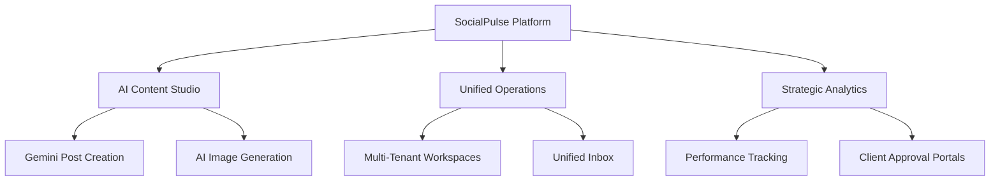

# 01. Introduction & Overview

Welcome to **SocialPulse**, the premier all-in-one, AI-powered social media management SaaS platform designed for modern agencies, entrepreneurs, and marketing teams.

## Mission
Our mission is to democratize high-conversion social media marketing by putting the power of advanced AI (Gemini) and enterprise-grade scheduling tools into the hands of every creator. SocialPulse isn't just a scheduling tool; it's a **Revenue Engine** that helps you transform engagement into growth.

## Platform Pillars

## Why SocialPulse?
In a world where social algorithms change daily, SocialPulse provides the stability and intelligence needed to stay ahead. Whether you're managing a single personal brand or a portfolio of 50 clients, our platform scales with you, providing the same premium experience at every level.

---
**[Index](../SOCIALPULSE_MANUAL.md)** | **[Next: Getting Started](./02_Getting_Started.md) →**

