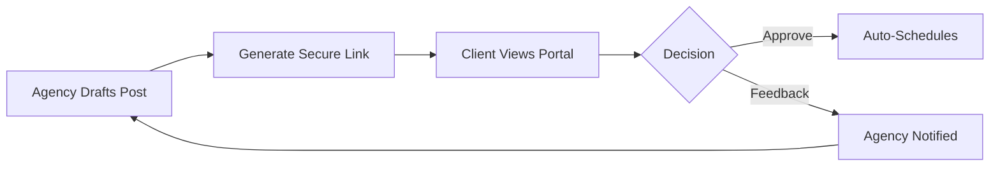

# 05. The Scheduler

The **Scheduler** is your production floor. It combines high-fidelity design with powerful automation to make publishing effortless.

## 1. Crafting Your Post
1. **Target Platforms**: Toggle the platform buttons at the top. Notice the branded gradients that appear when a platform is selected.
2. **Content Editor**: Write your caption. The system includes real-time character counting tailored to each platform's limits (e.g., 280 for X).
3. **Media Attachment**:
   - **Upload**: Drop files directly.
   - **Library**: Pick existing assets from your cloud-synced Media Library.
   - **Canva**: Launch the Canva editor directly from the post composer.

## 2. Scheduling Logic
* **Publish Now**: Pushes your content to all selected platforms immediately.
* **Timed Scheduling**: Choose a specific date and time.
* **Bulk Scheduling**: Upload a CSV template containing weeks of content. SocialPulse will parse the file and populate your queue automatically.

## 3. High-Fidelity Preview
Before you schedule, use the "Preview" toggle to see exactly how your post will look natively on:
* Mobile feeds (Instagram/Facebook)
* Desktop timelines (X/LinkedIn)

## 4. Client Approval Portals
For agency owners, the "Share for Approval" feature is a game-changer.

1. Click the **Share** icon on any scheduled post.
2. Send the generated link to your client.
3. **The Portal**: Your client sees a beautiful, branded page where they can approve or request changes. **No login is required for the client.**

---
**← [04. Social](./04_Social_Accounts.md)** | **[Index](../SOCIALPULSE_MANUAL.md)** | **[Next: Inbox](./06_Inbox.md) →**

