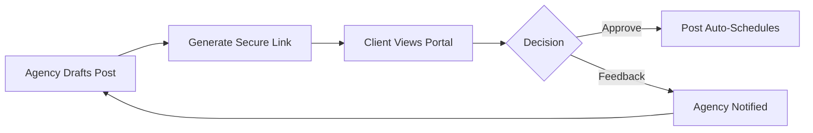

# 05. The Scheduler

The **Scheduler** is your production floor. It combines high-fidelity design with powerful automation to make publishing effortless.

## 1. Crafting Your Post
1. **Target Platforms**: Toggle the platform buttons at the top. Notice the branded gradients that appear when a platform is selected.
2. **Content Editor**: Write your caption. The system includes real-time character counting tailored to each platform's limits (e.g., 280 for X).
3. **Media Attachment**:
   - **Upload**: Drop files directly.
   - **Library**: Pick existing assets from your cloud-synced Media Library.

## 2. Scheduling Logic
* **Publish Now**: Pushes your content to all selected platforms immediately.
* **Timed Scheduling**: Choose a specific date and time.
* **Bulk Scheduling**: Switch to the **Bulk** tab and paste or upload multiple posts at once. Pro and Enterprise plans support up to 100 posts per bulk operation.

## 3. High-Fidelity Preview
Before you schedule, use the "Preview" toggle to see exactly how your post will look natively on:
* Mobile feeds (Instagram/Facebook)
* Desktop timelines (X/LinkedIn)

## 4. Client Approval Portals
For agency owners, the "Share for Approval" feature is a game-changer.

1. Click the **Share** icon on any scheduled or draft post.
2. SocialPulse generates a unique, tamper-proof token and returns a shareable link.
3. Send the link to your client.
4. **The Portal**: Your client sees a branded page showing the post content, media, and target platforms. They can **Approve** (which sets the post to `scheduled`) or **Request Changes** (which returns the post to `draft` and stores their written feedback).
5. **No login is required for the client.**
6. **API endpoints**:
   - `POST /api/approvals/generate-link` — body: `{ postId }` — returns `{ token }`
   - `GET  /api/approvals/public/:token` — public view of the post
   - `POST /api/approvals/public/:token/submit` — body: `{ status: 'approved'|'rejected', feedback? }`

---
**← [04. Social](./04_Social_Accounts.md)** | **[Index](../SOCIALPULSE_MANUAL.md)** | **[Next: Inbox](./06_Inbox.md) →**

