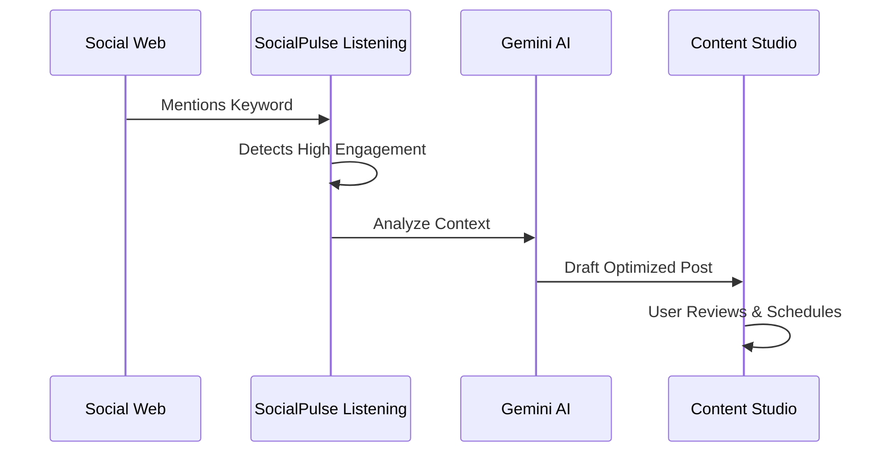

# 07. Social Listening & Automation

SocialPulse doesn't just help you talk; it helps you listen. **Social Listening** allows you to monitor the global conversation for trends, mentions, and competitive intelligence.

## 1. Setting Up Rules
1. **Keywords**: Define the words or phrases you want to monitor (e.g., your brand name, "social media SaaS," or a competitor's name).
2. **Platforms**: Select where to listen (X, Web, News).
3. **Exclusions**: Use negative keywords to filter out noise (e.g., track "Apple" but exclude "fruit").

## 2. Trend-to-Post Automation
This is the ultimate growth hack.

* **Identify**: When a high-engagement post matches your rule, it appears in your Listening feed.
* **Draft with AI**: Click the "Draft with AI" button on any result.
* **The Magic**: SocialPulse automatically pulls the context of that trend into the Content Studio and drafts a conversion-optimized post reacting to it. This allows you to jump on trending topics in seconds.

## 3. Automation Rules
For power users, you can create "If-This-Then-That" workflows:
* **Trigger**: "When keyword X is mentioned with positive sentiment..."
* **Action**: "...Auto-reply with a thank you message" or "...Tag the Sales team in Slack."

## 4. Competitive Intelligence
Set up rules to track your competitors. Understand what their customers are complaining about or praising, and use that data to refine your own marketing strategy.

---
**← [06. Inbox](./06_Inbox.md)** | **[Index](../SOCIALPULSE_MANUAL.md)** | **[Next: Analytics](./08_Analytics.md) →**

